# 🚀 AlienCloud Project

AlienCloud is a **cloud-native Spring Boot application** designed to provide secure, user-isolated file uploads over **SFTP through Tailscale**.  
This setup allows developers and end-users to store files securely on a remote Linux server while keeping the deployment modern, scalable, and private.

---

## ✨ Features
- Secure file uploads from web clients.  
- Per-user folder isolation with Linux-level permissions (`chmod 700`).  
- Transparent tunneling over **Tailscale Mesh VPN**.  
- Deployable on **Render** (backend) + **Linux server** (storage).  
- Clean architecture with `SftpStorageService` + `FileUploadController`.  

---

## 🏗️ High-Level Architecture


---

## 🔄 Sequence Flow

```mermaid
sequenceDiagram
    participant User as 👤 User (Browser)
    participant Controller as Spring Boot Controller
    participant Service as SftpStorageService
    participant SFTP as Linux SFTP Server

    User->>Controller: POST /files/upload (multipart file)
    Controller->>Service: uploadFile(username, file)
    Service->>SFTP: SFTP put (file → /uploads/username/)
    SFTP-->>Service: Success (file stored)
    Service-->>Controller: OK
    Controller-->>User: "✅ File uploaded"
```



---

## 🏗️ Infrastructure Overview

## 🏗️ Infrastructure Overview

```mermaid
flowchart TD
    subgraph Cloud[🌐 Render Cloud Hosting]
        A[Spring Boot App <br/> (AlienCloud)]
    end

    subgraph Tailscale[🔒 Tailscale Mesh VPN]
        A <--> B
    end

    subgraph UserSide[👨‍💻 User]
        U[Browser / Client]
    end

    subgraph Server[💻 Remote Linux Server]
        B[SFTP Service (sshd) <br/> Tailscale IP: 100.x.x.x]
        D[/home/alienbamboo/uploads/]
    end

    U -->|File Upload HTTP POST| A
    A -->|SFTP (over Tailscale)| B
    B -->|Store securely| D
```

### 🔍 Explanation of Flow
1. **User uploads a file** via browser → Render-hosted Spring Boot app.  
2. **Spring Boot app (AlienCloud)** accepts request and delegates to `SftpStorageService`.  
3. The app connects via **Tailscale SFTP tunnel** to the Linux server.  
4. **Linux SFTP server** writes file into `/home/alienbamboo/uploads/<username>/`.  
5. Files are **private & secure** (`chmod 700`).  

---

## 🛠️ Design Patterns Used
- **Dependency Injection (Spring)** – decouples services.  
- **Strategy Pattern** – file storage backend can be swapped (`SftpStorageService` vs. local).  
- **Factory Pattern** – Spring Boot config (`SftpConfig`) generates SFTP channels.  
- **Separation of Concerns** – controllers handle HTTP, services handle SFTP.  
- **Lazy Initialization** – SFTP connections created on demand.  

---

## 📂 File Upload Workflow
1. User selects file(s) in browser.  
2. JavaScript sends `multipart/form-data` request.  
3. Spring Controller accepts and calls `SftpStorageService`.  
4. Service connects via **JSch** to SFTP server.  
5. File uploaded to `/home/alienbamboo/uploads/<username>/`.  
6. Permissions enforced with `chmod 700`.  

---

## 🔒 Security Considerations
- Tailscale ensures **private mesh networking**.  
- SFTP authentication with strong username/password.  
- Linux folder permissions prevent cross-user access.  
- Spring validation ensures safe file handling.  

---

## 🚀 Deployment Guide
1. Deploy Spring Boot app to **Render**.  
2. Install & run **Tailscale** on both Render and Linux server.  
3. Ensure `sshd` is running on Linux (`systemctl status ssh`).  
4. Configure `application.yml` with Tailscale IP + credentials.  
5. Upload files → verify on `/home/alienbamboo/uploads/`.  

---

## 📌 Example `application.yml`
```yaml
sftp:
  host: 100.98.121.85   # Tailscale IP of Linux server
  port: 22
  username: ${SERVER_USERNAME}
  password: ${SERVER_PASSWORD}
  remoteDir: /home/alienbamboo/uploads/
```

---

## ✅ Conclusion
AlienCloud combines **modern Spring Boot design**, **VPN-based privacy (Tailscale)**, and **classic Linux security** to provide a robust, scalable, and secure **file upload system**.
